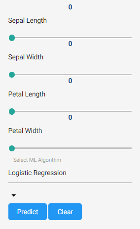
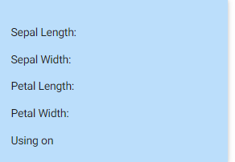
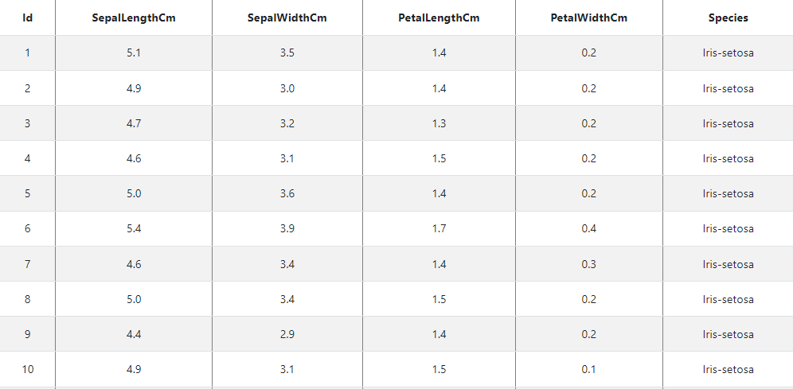
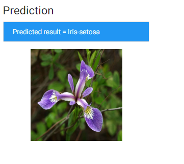

# Iris-Classification
iris classification 
This program applies basic machine learning (classification) concepts on Fisher's Iris Data to predict the species of a new sample of Iris flower.

Software and Libraries
Python 3.12.0
Flask 3.0.2
Jupyetr Notebook
scikit-learn 1.5.1

Introduction
 The Iris flower data set or Fisher's Iris data set is a multivariate data set introduced by the British statistician and biologist Ronald Fisher in his 1936 paper The use of multiple measurements in taxonomic problems as an example of linear discriminant analysis.

